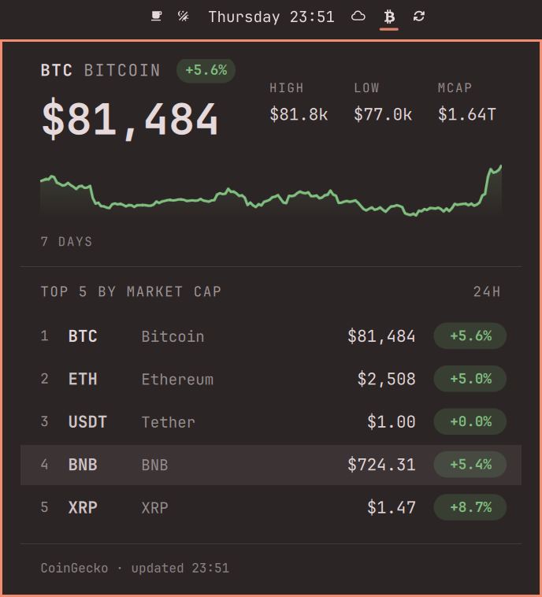
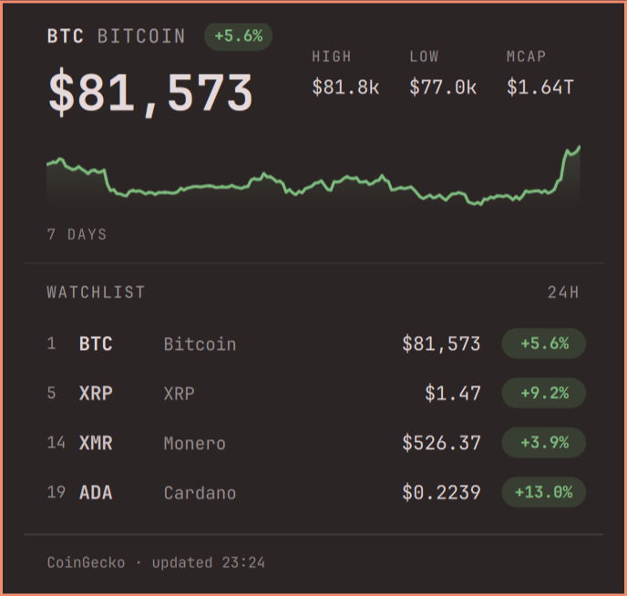
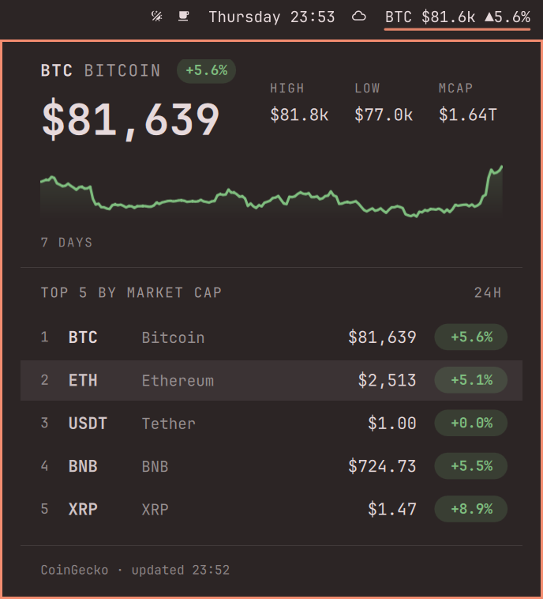
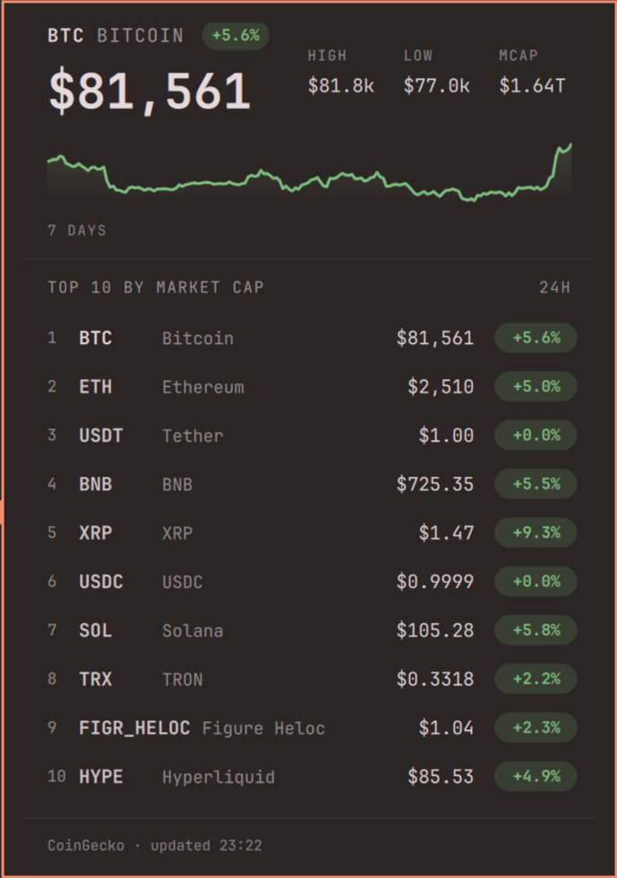

<h1 align="center">Omacoins</h1>

<p align="center">
  Coin prices and 24h movement in the Omarchy bar, from CoinGecko's keyless API. No account, no API key.
</p>

<p align="center">
  <a href="https://github.com/bernardcosta/omarchy-omacoins/tags"></a>
</p>

<p align="center">
  
</p>

## What it shows

- **The lead coin in full**: price, 24h change, session high and low, market cap
  and a seven-day sparkline, drawn in Omarchy's own panel idiom.
- **A ranked list** underneath: the top coins by market cap, or a watchlist you
  name yourself. Click any row to promote it to the hero.
- **In the bar**: a single ₿ glyph that stays out of the way, or the lead coin's
  price and movement inline. Left click opens the panel, middle click refreshes.

## Install

```bash
omarchy plugin add https://github.com/bernardcosta/omarchy-omacoins --enable
```

`--enable` places the widget on the bar. Nothing else to build, and no key to
obtain: CoinGecko's `/coins/markets` endpoint is public.

## Track your own coins

Name any CoinGecko ids and the market-cap list becomes your own watchlist. The
header changes to `WATCHLIST` and every row keeps its market-cap rank, so you
can still see where your picks sit overall:

```bash
omarchy bar set ber.omacoins coins bitcoin,xrp,monero,cardano
```

<p align="center">
  
</p>

Set the value empty to go back to the top coins by market cap:

```bash
omarchy bar set ber.omacoins coins ""
```

## Icon or full bar pill

The bar carries a single glyph by default, so the widget costs almost no room
until you want it. Switch to `full` and the lead coin's price and movement sit
in the bar itself. Same plugin, same panel, one setting between them.

| | |
|:---:|:---:|
| <br>**`display: "icon"`**<br>the default; hover for the lead coin's price | <br>**`display: "full"`**<br>price and 24h movement, inline |

```bash
omarchy bar set ber.omacoins display full   # and 'icon' to go back
```

## Show more coins

`count` sets how many rows the panel lists, anywhere from 1 to 25:

```bash
omarchy bar set ber.omacoins count 10
```

<p align="center">
  
</p>

## How it works

The panel asks CoinGecko's `/coins/markets` for one page ordered by market cap,
with the 24h change and a seven-day sparkline in the same response, so a refresh
is a single request no matter how many coins are listed. It refreshes on a timer
every three minutes by default, when the panel opens on stale data, and on a
middle click.

The timer runs whether or not the panel is open, because in `full` mode the bar
pill carries a live price. There is no account and no API key; the keyless
endpoint is rate limited, and `refreshMinutes` will not go below one minute.

## Settings

| Setting | Default | Notes |
|---------|---------|-------|
| `display` | `icon` | `icon` is a single glyph; `full` puts price and movement in the bar. |
| `icon` | ₿ | The icon-mode glyph, nf-fa-btc (U+F15A). Any character the bar font carries. |
| `currency` | `usd` | Any CoinGecko `vs_currency`. Prices, highs, lows and market caps all follow it. |
| `coins` | empty | Comma-separated CoinGecko ids. Empty means the top coins by market cap. |
| `count` | `5` | How many rows the panel lists, 1 to 25. |
| `refreshMinutes` | `3` | Auto-refresh interval, minimum 1. |

Settings live in the widget's entry in `~/.config/omarchy/shell.json` and
hot-reload on save. The stock command is the easiest way to change one:

```bash
omarchy bar set ber.omacoins refreshMinutes 5
```

Or edit the entry directly:

```jsonc
{
  "id": "ber.omacoins",
  "display": "icon",                   // "icon" = single glyph (default); "full" = price + 24h movement
  "icon": "",                          // icon-mode glyph; default is nf-fa-btc (U+F15A)
  "currency": "usd",                   // fiat base: eur, jpy, gbp, ... (CoinGecko vs_currency)
  "coins": "bitcoin,ethereum,solana",  // CoinGecko ids; empty = top N by market cap
  "count": 5,                          // how many coins to show (1-25)
  "refreshMinutes": 3                  // auto-refresh interval
}
```

### Resetting a setting

`omarchy bar set` only ever assigns — there is no unset or remove subcommand.
To restore a default, set the value **empty**:

```bash
omarchy bar set ber.omacoins coins ""      # back to the top N by market cap
omarchy bar set ber.omacoins currency ""   # back to usd
omarchy bar set ber.omacoins icon ""       # back to the default ₿ glyph
```

Every setting treats an empty value as unset, so this works for all of them.
The key stays in `shell.json` as `""`; delete the line by hand if you want it
gone entirely.

### Comma lists take no spaces

The value is a single shell argument, so a space splits the list and the CLI
rejects what follows:

```bash
omarchy bar set ber.omacoins coins bitcoin, monero    # ✗ unknown option: monero
omarchy bar set ber.omacoins coins bitcoin,monero     # ✓
omarchy bar set ber.omacoins coins "bitcoin, monero"  # ✓ quoted, spaces stripped
```

### Numbers

`count` and `refreshMinutes` are written as JSON strings unless you add
`--json`. Omacoins parses either, so `count 10` and `count 10 --json` behave
identically — the flag only keeps `shell.json` matching the shape above.

### Base currency

`currency` accepts any CoinGecko `vs_currency` code (`usd`, `eur`, `jpy`,
`gbp`, `chf`, `btc`, …); prices, highs/lows, and market caps all follow it.
Common codes get their proper symbol (€, ¥, £); anything unmapped is shown
with its uppercase code. An unsupported code makes the fetch fail — the panel
will say so, and setting a valid code recovers on the spot.

```bash
omarchy bar set ber.omacoins currency eur   # € prices
omarchy bar set ber.omacoins currency chf   # "CHF " — a valid code with no symbol mapped
omarchy bar set ber.omacoins currency btc   # ₿ — crypto bases work too
omarchy bar set ber.omacoins currency ""    # back to usd
```

## Keybinding

Plugins never install keybindings — bindings belong to you, in
`~/.config/hypr/bindings.lua`. To toggle the panel from the keyboard, add:

```lua
-- The unbind is defensive: Hyprland fires ALL binds on a combo, so if a
-- future Omarchy default (or another binding of yours) lands on this key,
-- unbinding first keeps this one exclusive. Unbinding a free key is a no-op.
hl.unbind("SUPER + CTRL + M")
o.bind("SUPER + CTRL + M", "Coins", "omarchy-shell shell toggle ber.omacoins")
```

Pick any free combo; check yours with `omarchy menu keybindings --print`.

## Roadmap

- Portfolio widget: total value and running P&L from a local
  `portfolio.json` (holdings never leave your machine)
- Optional CoinMarketCap API key as an alternative data source

## Credits

Prices, market caps and sparklines come from
[CoinGecko](https://www.coingecko.com), whose public API needs no account and no
key. The panel is a display for it.
