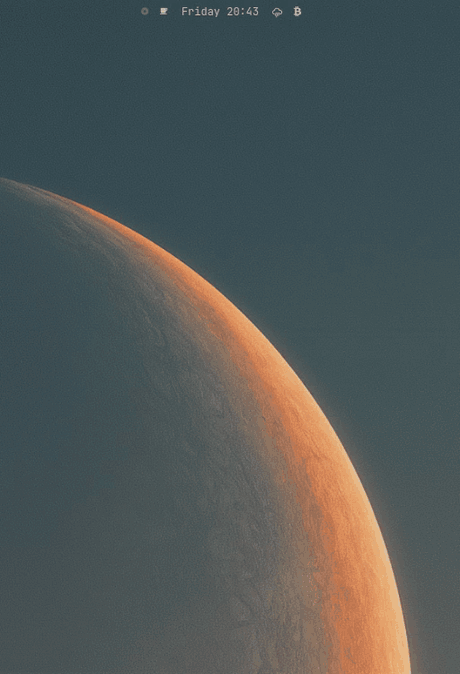
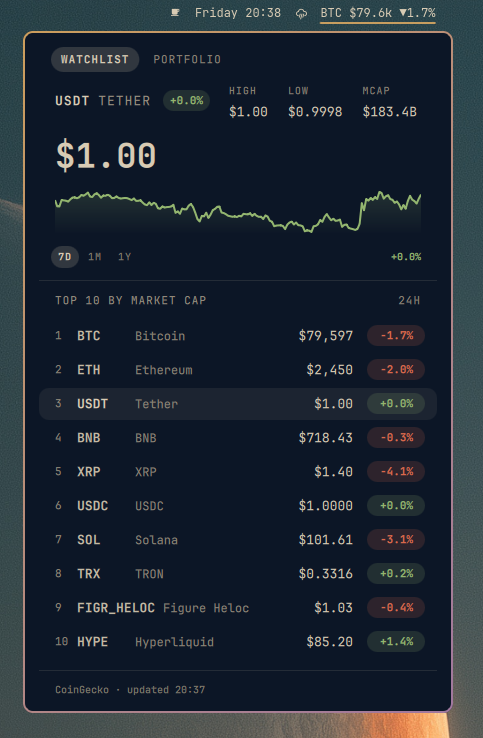
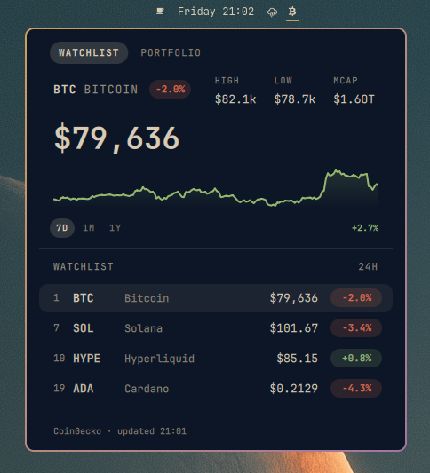
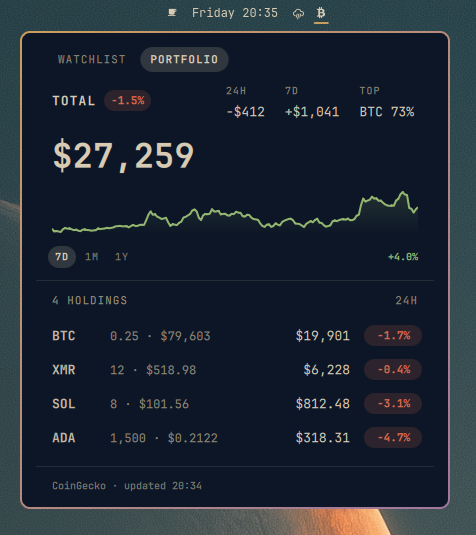
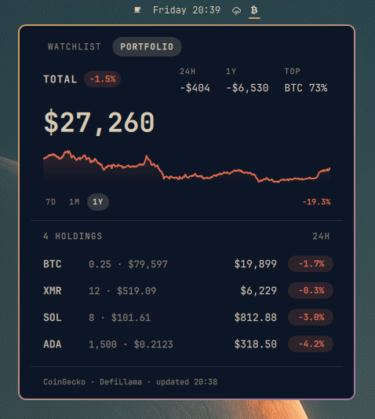
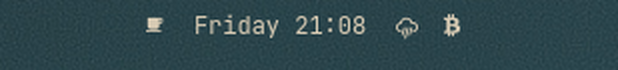
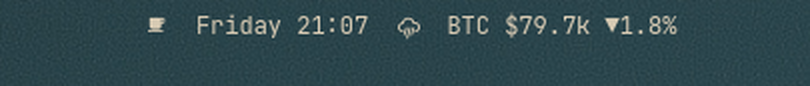
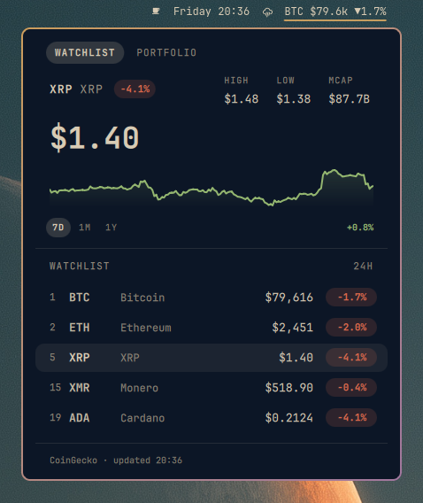
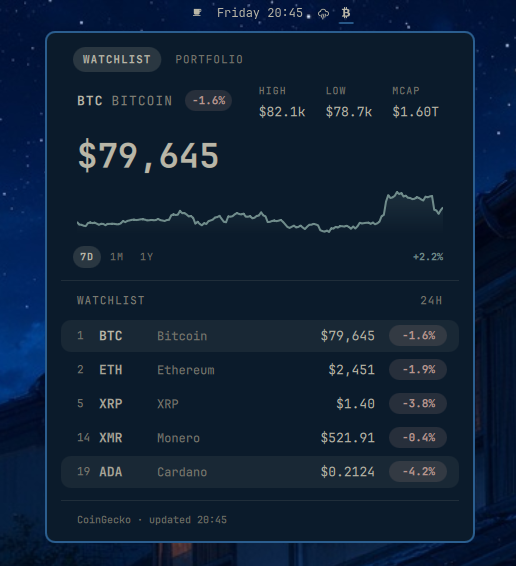

<h1 align="center">Omacoins</h1>

<p align="center">
  Crypto prices, charts and your own portfolio in the Omarchy bar.<br>
  No account, no API key, and your holdings never leave your machine.
</p>

<p align="center">
  <a href="https://github.com/bernardcosta/omarchy-omacoins/tags"></a>
  <a href="LICENSE"></a>
</p>

<p align="center">
  
</p>

## At a glance

- **Watchlist** — the top coins by market cap, or any coins you name. Each row
  carries its rank, price and 24h change; the featured coin gets a hero with
  its high, low, market cap and a chart.
- **Portfolio** — a second tab that reads a local `portfolio.json` and shows
  what your holdings are worth, how the total moved over 24h and over the
  chart range, and every position with its value and daily change.
- **Week, month or year** — one click switches the chart, on either tab.
- **In the bar** — a single ₿ glyph, or the lead coin's price and movement
  inline. Left click opens the panel, middle click refreshes.
- **Your theme's colors** — up and down shades come from the active Omarchy
  theme, and follow it when you switch.
- **Keyless** — public endpoints only, from CoinGecko and DefiLlama.

## Install

```bash
omarchy plugin add https://github.com/bernardcosta/omarchy-omacoins --enable
```

`--enable` places the widget on the bar. Nothing to build and no key to
obtain. To manage it later:

```bash
omarchy plugin update ber.omacoins    # pull the latest release
omarchy plugin disable ber.omacoins   # take it off the bar, keep it installed
omarchy plugin enable ber.omacoins    # put it back
omarchy plugin remove ber.omacoins    # uninstall it entirely
```

Your settings and your portfolio survive all of these. Settings live in the
`ber.omacoins` entry of `~/.config/omarchy/shell.json`; the portfolio lives in
`~/.config/omacoins/`. Neither is touched by an update or a remove, so a
reinstall picks up exactly where you left off. Delete them by hand for a clean
slate:

```bash
rm -r ~/.config/omacoins          # your portfolio file
```

## Watchlist

By default the panel lists the top coins by market cap. `count` sets how many,
from 1 to 25:

```bash
omarchy bar set ber.omacoins count 10
```

<p align="center">
  
</p>

Or name your own coins by CoinGecko id, and the list becomes your watchlist.
Every row keeps its market-cap rank, so you can still see where your picks sit
overall:

```bash
omarchy bar set ber.omacoins coins bitcoin,solana,hyperliquid,cardano
omarchy bar set ber.omacoins coins ""      # back to the top coins
```

<p align="center">
  
</p>

Click any row, or press `j`/`k`, to feature that coin in the hero. The id is
the last part of a coin's CoinGecko URL: `coingecko.com/en/coins/monero` →
`monero`.

## Portfolio

Keep what you own in one small file and the panel grows a **Portfolio** tab.

> [!IMPORTANT]
> **Your holdings stay on your machine.** The file is read locally and never
> uploaded, synced or sent anywhere. The only thing that leaves your computer
> is the list of coin ids, in the same public price request the watchlist
> makes. Amounts are never transmitted.

### Set it up

The file is `~/.config/omacoins/portfolio.json`. Create it with CoinGecko ids
and the amount you hold of each:

```bash
mkdir -p ~/.config/omacoins
$EDITOR ~/.config/omacoins/portfolio.json
```

```json
{
  "bitcoin": 0.25,
  "monero": 12,
  "solana": 8,
  "cardano": 1500
}
```

That is the whole setup. The tab appears as soon as the file exists, and the
panel re-reads it on every save, so you can adjust a position and watch the
total move.

<p align="center">
  
</p>

### What it shows

- **Total** in your currency, with its 24h change as a badge.
- **24H** and **7D** (or **1M** / **1Y**, following the chart range) — how much
  the total moved, in money.
- **TOP** — your largest position and its share of the total.
- **Holdings**, largest first: amount and current price on the left, value and
  24h change on the right.

An id CoinGecko doesn't know stays listed as `not a CoinGecko id`, so a typo is
visible instead of silently missing from the total.

### Options

```bash
omarchy bar set ber.omacoins tab portfolio            # open on the portfolio tab
omarchy bar set ber.omacoins portfolio ~/notes/coins.json   # keep the file elsewhere
```

If you prefer one entry per line, an array works too, and extra keys are
ignored, so notes of your own are fine:

```json
[
  { "id": "bitcoin", "amount": 0.25, "note": "cold wallet" },
  { "id": "monero", "amount": 12 }
]
```

## Week, month or year

The `7D` `1M` `1Y` buttons under the chart pick its range, on either tab. The
figure on the right is the move over that range, and on the portfolio tab the
middle stat follows it too. Press `1`, `2` or `3` to switch from the keyboard.

<p align="center">
  
</p>

```bash
omarchy bar set ber.omacoins range 1y      # 7d (default), 30d or 1y at startup
```

The week comes with the price data. A month or a year is fetched from
DefiLlama's open price API the first time you pick it, featured coin or
holdings first, then the rest of the coins on screen in the background, so
featuring another coin or switching tabs is instant. History is priced in US
dollars and scaled onto each coin's live price, so the chart's shape and end
point are exact; in another currency the far end can drift by the exchange-rate
move over the range.

## In the bar

The widget is a single ₿ glyph by default, so it costs almost no room until
you want it. Switch to `full` and the lead coin's price and 24h movement sit
in the bar itself:

| `display: "icon"` (default) | `display: "full"` |
|:---:|:---:|
|  |  |
| the glyph; hover for the price | price and 24h movement, inline |

```bash
omarchy bar set ber.omacoins display full    # 'icon' to go back
omarchy bar set ber.omacoins icon ""        # any glyph the bar font carries
```

<p align="center">
  
</p>

## Currency

Any CoinGecko `vs_currency` works: `usd` (default), `eur`, `gbp`, `jpy`, `chf`,
even `btc`. Prices, highs and lows, market caps and portfolio values all
follow it. Common codes get their symbol; anything unmapped shows its code.

```bash
omarchy bar set ber.omacoins currency eur
omarchy bar set ber.omacoins currency ""     # back to usd
```

## Matches your theme

Green means up and red means down, but the shades are your theme's own:
Omacoins reads `green` and `red` from the active theme's palette, so badges,
fills and charts sit in the same colors as the rest of your desktop. Switching
themes recolors the panel live.

<p align="center">
  
</p>

## Keyboard and keybindings

While the panel is open:

| Key | Action |
|---|---|
| `←` `→` or `h` `l` | Switch between Watchlist and Portfolio |
| `↑` `↓` or `j` `k` | Feature the previous / next watchlist coin |
| `1` `2` `3` | Chart range: 7D, 1M, 1Y |
| `Tab` | Jump to the neighbouring bar panel |
| `Esc` | Close |

Plugins never install keybindings — those belong to you, in
`~/.config/hypr/bindings.lua`. To open the panel from the keyboard:

```lua
-- The unbind is defensive: Hyprland fires ALL binds on a combo, so if a
-- future Omarchy default (or another binding of yours) lands on this key,
-- unbinding first keeps this one exclusive. Unbinding a free key is a no-op.
hl.unbind("SUPER + CTRL + M")
o.bind("SUPER + CTRL + M", "Coins", "omarchy-shell ber.omacoins toggle")
o.bind("SUPER + CTRL + P", "Portfolio", "omarchy-shell ber.omacoins portfolio")
```

The plugin's IPC target accepts `open`, `close`, `toggle`, `refresh`,
`watchlist` and `portfolio`. Pick any free combo; check yours with
`omarchy menu keybindings --print`.

## Settings

| Setting | Default | Notes |
|---|---|---|
| `display` | `icon` | `icon` is a single glyph; `full` puts price and movement in the bar. |
| `icon` | ₿ | The icon-mode glyph, nf-fa-btc (U+F15A). Any character the bar font carries. |
| `currency` | `usd` | Any CoinGecko `vs_currency`. |
| `coins` | empty | Comma-separated CoinGecko ids. Empty means the top coins by market cap. |
| `count` | `5` | How many rows the watchlist lists, 1 to 25. |
| `refreshMinutes` | `3` | Auto-refresh interval, minimum 1. |
| `portfolio` | `~/.config/omacoins/portfolio.json` | Holdings file for the portfolio tab. `~` expands. |
| `tab` | `watchlist` | Tab shown at startup: `watchlist` or `portfolio`. |
| `range` | `7d` | Chart range at startup: `7d`, `30d` or `1y`. |

Settings hot-reload on save. `omarchy bar set` is the easiest way to change
one, or edit the entry in `~/.config/omarchy/shell.json` directly:

```jsonc
{
  "id": "ber.omacoins",
  "display": "icon",
  "icon": "",
  "currency": "usd",
  "coins": "bitcoin,ethereum,solana",
  "count": 5,
  "refreshMinutes": 3,
  "portfolio": "",          // empty = ~/.config/omacoins/portfolio.json
  "tab": "watchlist",
  "range": "7d"
}
```

A few things worth knowing:

- **Resetting**: `omarchy bar set` only assigns, so restore a default by
  setting the value empty: `omarchy bar set ber.omacoins coins ""`. Every
  setting treats empty as unset.
- **Comma lists take no spaces**: `coins bitcoin,monero` works;
  `coins bitcoin, monero` does not, unless quoted.
- **Numbers** are written as strings unless you add `--json`. Both are read
  the same way.
- **An unsupported currency** makes the fetch fail; the panel says so, and a
  valid code recovers on the spot.

## How it works

One request to CoinGecko's public `/coins/markets` brings price, 24h change,
market cap and the week's sparkline for every coin listed, so the watchlist
costs one call per refresh however many coins it shows. A portfolio adds one
more of the same shape. The month and year charts come from DefiLlama's
`coins.llama.fi/chart`, which takes the same CoinGecko ids and serves several
coins per request; CoinGecko's per-coin history is the fallback for a coin
DefiLlama doesn't have.

The panel refreshes every three minutes by default, on open when its data is
stale, and on a middle click. The timer runs even with the panel closed,
because in `full` mode the bar pill carries a live price. The keyless
endpoints are rate limited, so the plugin keeps last-good data on a failure,
spaces its retries, and never goes below a one-minute refresh.

## Roadmap

- Cost basis in `portfolio.json`, for profit and loss per position
- Portfolio total as a bar pill option, next to `icon` and `full`

## Contributing

Bug reports and small focused PRs are welcome — see
[CONTRIBUTING.md](CONTRIBUTING.md) for a development copy, the architecture,
and the one restart gotcha that will otherwise waste your afternoon. Security
issues should go through [SECURITY.md](SECURITY.md) rather than a public issue.

## License and dependencies

Omacoins is released under the [MIT License](LICENSE).

It bundles no third-party code and vendors nothing. At runtime it depends only
on what Omarchy already provides — Quickshell/QML and `curl` — plus two public
data services:

| Service | Role | Terms |
|---|---|---|
| [CoinGecko API](https://www.coingecko.com/en/api) | Prices, 24h change, market caps and weekly sparklines, via the keyless `/coins/markets` endpoint; fallback for month and year history | [CoinGecko Terms](https://www.coingecko.com/en/terms) |
| [DefiLlama API](https://defillama.com/docs/api) | Month and year price history, via the open `coins.llama.fi/chart` endpoint | [DefiLlama docs](https://defillama.com/docs/api) |

No account, no API key, no telemetry. Market data belongs to its providers;
this panel is a display for it.

Prices are shown for information only and are not financial advice. Public
endpoints can lag or fail — do not trade on this widget.
